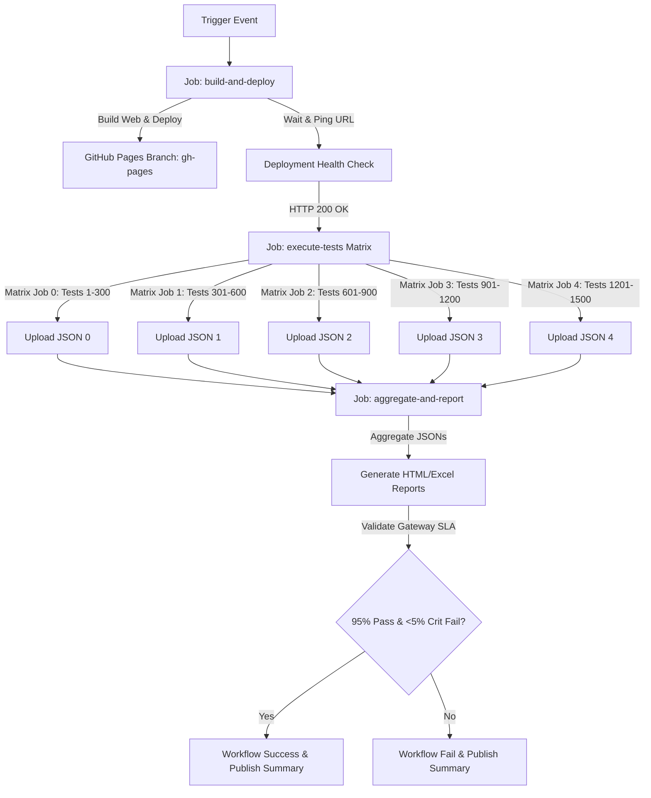

# MedIntel Nexus — Automation, Deployment & Quality Reporting Guide

This guide details the layout, execution, and troubleshooting steps for the enterprise test automation framework and the continuous integration/continuous deployment (CI/CD) pipeline.

---

## 📂 Project Directory Structure

The framework is structured as follows:

```
automation/
├── AUTOMATION_GUIDE.md      # This documentation guide
├── config/
│   └── config.py            # Environment-driven settings loader (BASE_URL, wait times)
├── data/
│   ├── scenarios.py         # Programmatic registry of 1,500 unique test scenarios
│   └── test_data.py         # Static and dynamic credentials and testing payloads
├── pages/
│   ├── base_page.py         # Shared Selenium wrapper utilities (explicit waits, etc.)
│   ├── login_page.py        # Authentication POM
│   ├── dashboard_page.py    # Main Patient Dashboard and menu routing POM
│   └── prescription_scan_page.py # Upload scanner and OCR analysis POM
├── tests/
│   ├── conftest.py          # Pytest fixtures and failure hook captures
│   └── test_selenium.py     # Main parallelized test runner slice
└── utils/
    ├── driver_factory.py    # Headless Chrome driver initialization factory
    ├── logger_util.py       # Custom double-output logger utility
    ├── report_generator.py  # Excel & HTML dashboard aggregate reporter
    └── summary_generator.py # SLA gateway evaluation checker
```

---

## 💻 Local Execution Guide

To execute the automation framework on your local workstation:

### 1. Prerequisites
- **Python**: Ensure Python 3.10+ is installed.
- **Google Chrome**: Ensure a stable Chrome version is installed on the machine.
- **Flutter**: (Optional, only needed if building/running the app locally).

### 2. Installation & Setup
Initialize a virtual environment and install the required dependencies:

```bash
# Navigate to the workspace root directory
cd medintel_nexus

# Create a python virtual environment
python -m venv venv
source venv/bin/activate  # On Windows, use: venv\Scripts\activate

# Install dependencies for the automation suite and backend
pip install selenium pytest openpyxl requests uvicorn
cd medintel-nexus-backend && pip install -r requirements.txt && cd ..
```

### 3. Start the FastAPI Backend
Start the backend server in a separate terminal:

```bash
cd medintel-nexus-backend
source venv/bin/activate  # or venv\Scripts\activate
uvicorn main:app --reload --port 8000
```

### 4. Execute the Tests
Execute the tests using Pytest. You can run all tests, or select a specific matrix slice of 300 tests by configuring the `JOB_INDEX` environment variable (0 to 4):

```bash
# To simulate matrix job 0 (Executes test cases 1 to 300)
export BASE_URL="https://sudarshanankt.github.io/medintel_nexus/"
export JOB_INDEX=0
pytest automation/tests/test_selenium.py -v --tb=short

# To run a different partition (e.g. partition 2: tests 601 to 900)
export JOB_INDEX=2
pytest automation/tests/test_selenium.py -v --tb=short
```

### 5. Generate and View Reports
After all test partition jobs run (or to run in single-machine mock aggregation mode), execute the reporting utility to aggregate results:

```bash
python automation/utils/report_generator.py
```
Open `automation/reports/HTML/dashboard.html` in your web browser to view the interactive dashboard.

---

## 🚀 CI/CD Execution Guide

The CI/CD pipeline is implemented in `.github/workflows/deploy-and-test.yml`. It runs automatically on:
- Every `push` to `main` or `master` branches.
- Every `pull_request` targetting `main` or `master`.
- Manual trigger using the `workflow_dispatch` button in the actions panel.

### Workflow Execution Flow


### SLA Quality Gates
The workflow evaluates SLA gates in the final job:
1. **Pass Rate**: Overall pass rate across all 1,500 tests must be **at least 95.00%**.
2. **Critical Severity**: Failure rate of test cases marked as `Critical` must not exceed **5.00%**.
If either SLA condition fails, the pipeline exits with error code 1, marking the GitHub Actions run as failed.

---

## 🛠️ Troubleshooting Guide

### 1. Mixed Content Errors (HTTPS to HTTP)
- **Problem**: When Selenium loads the page from `https://sudarshanankt.github.io/medintel_nexus/`, Chrome may block requests to `http://localhost:8000` because the frontend is secure (HTTPS) and the local backend is insecure (HTTP).
- **Solution**: The framework configures Chrome options `--allow-running-insecure-content` and `--disable-web-security` inside `automation/utils/driver_factory.py` to bypass this block for local automation checks. Ensure these options are not deleted.

### 2. Chrome Sandbox Issues in Linux CI
- **Problem**: Chrome fails to start in Linux runner environments with permission errors.
- **Solution**: The webdriver setup uses the `--headless=new` and `--no-sandbox` flags. Do not remove `--no-sandbox` when running in Docker or virtual machines.

### 3. Missing Reports or Screenshots
- **Problem**: The final report contains broken screenshot or log links.
- **Solution**: The reports generation maps paths relative to `automation/reports`. In the CI pipeline, make sure artifacts are uploaded together using the path `automation/reports/` to keep directory links valid when downloaded.

### 4. Port 8000 Collision
- **Problem**: The FastAPI backend fails to start because port 8000 is already in use.
- **Solution**: Check running processes using `lsof -i :8000` on macOS/Linux and terminate the process.
